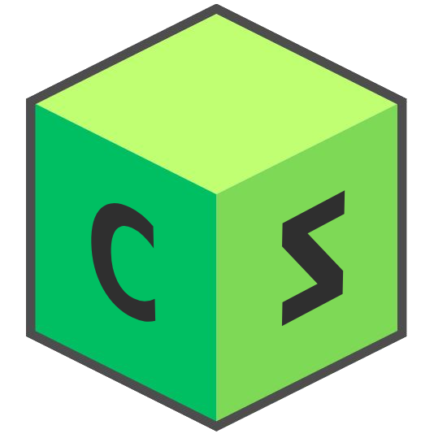

<h1 align="center">Taller 2: Analizador sintáctico y desarrollo del Lenguaje de Programación con JFLEX y CUP</h1>
<p align="center">
  
</p>

## Descripción
Este es un lenguaje de programación completo que soporta las siguientes características:

## Características
- Estructuras de control como `for`, `while`, `if`, `if else`.
- Definición y llamada de funciones, incluyendo soporte para recursión.
- Funciones integradas para la manipulación de arreglos y cadenas.
- Soporte para matrices de N dimensiones.

## Requisitos

- Java 17 o superior (Usamos la version 21 LTS)
- Maven

## Compilación y Ejecución

Para compilar el proyecto, navegue hasta el directorio raíz del proyecto y ejecute el siguiente comando:

```bash
mvn clean package
```
Se crearán dos archivos jar en la carpeta `target/`:

- [Lenguajes_2024_1-1.0-SNAPSHOT-jar-with-dependencies.jar](target%2FLenguajes_2024_1-1.0-SNAPSHOT-jar-with-dependencies.jar): Este archivo es un jar con todas las dependencias incluidas.
- [Lenguajes_2024_1-1.0-SNAPSHOT.jar](target%2FLenguajes_2024_1-1.0-SNAPSHOT.jar): Este archivo es un jar sin dependencias.
Para ejecutar el proyecto, use el siguiente comando, reemplazando `nombre-del-archivo` con el nombre de su archivo de entrada:

```bash
java -jar target/Lenguajes_2024_1-1.0-SNAPSHOT-jar-with-dependencies.jar
```

Adicionalmente hemos agregado unos archivos compilados jar del proyecto, los cuales pueden ser ejecutados con el siguiente comando:

```bash
java -jar EJECUTABLE/Lenguajes_2024_1.jar
```
```bash
java -jar EJECUTABLE/COMPILADOR.jar PROGRAMA.cz
```


## Ejemplos

Puede encontrar ejemplos de programas escritos en nuestro lenguaje en el directorio `src/test/resources/`.
Así como tambien en la carpeta `EJECUTABLE/` se encuentran los archivos de prueba.

## Equipo de Desarrollo

- Cesar Fabian Rincon Robayo: crinconro@unal.edu.co
- Julian Andres Vargas Gutierrez: julvargasgu@unal.edu.co
- Diana Marcela Bello Lopez: dbellol@unal.edu.co
- Javier Esteban Gonzalez Vivas: javgonzalezvi@unal.edu.co
- Kevin Julian Gonzalez Guerra: kgonzalezg@unal.edu.co

## Licencia

Este proyecto está licenciado bajo los términos de la licencia MIT.

## Contribuciones

Las contribuciones son bienvenidas. Por favor, abra un problema o haga un pull request para sugerencias de mejoras o correcciones de errores.

## Agradecimientos

Agradecemos a la Universidad Nacional de Colombia por proporcionar el entorno y los recursos para desarrollar este proyecto.